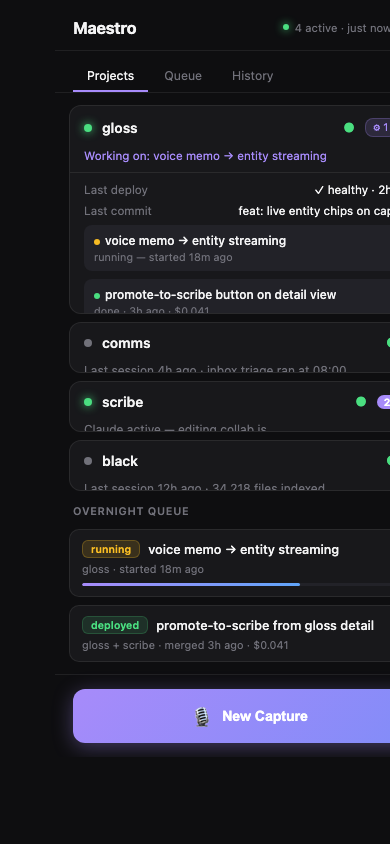

# Maestro

You describe a feature you want built — by voice on your phone or by typing — and Maestro handles the rest overnight. It writes the code, runs the tests, and deploys it to production. In the morning you wake up to either a green "deployed" or a clear explanation of why it stopped.

It orchestrates a five-app personal suite: [gloss](https://github.com/nathan0colestock-code/gloss) · [comms](https://github.com/nathan0colestock-code/comms) · [scribe](https://github.com/nathan0colestock-code/scribe) · [black](https://github.com/nathan0colestock-code/black)



---

## How it works

```
 iPhone PWA capture  ──▶  cloud intake
                              │
                              ▼
                      Gemini router classifies which project(s)
                              │
                              ▼
                      feature set queued for overnight run
                              │
                              ▼  (23:00 local, or on next daemon open)
                    local daemon → spawns `claude -p` worker in the right repo
                              │
                              ▼
                    worker implements on a branch, runs tests
                              │
                              ▼
                    tests green  →  merge  →  fly deploy  →  health check
                              │                                    │
                              ▼                                    ▼
                   tests red / deploy bad:              merged_and_deployed ✓
                   revert, mark for review
```

---

## Architecture

| Component | Where | What |
|---|---|---|
| **cloud** | Fly.io, `cloud/` | REST API for capture intake, feature-set state, worker pings; serves the PWA |
| **web** | `web/` (PWA) | iPhone home-screen app for drops and fleet health. Works offline; IndexedDB queue replays on reconnect |
| **local daemon** | your laptop, `local/`, registered as a LaunchAgent | Polls cloud, spawns Claude workers, runs the test + merge + deploy pipeline |
| **workers** | ephemeral `claude -p` sessions | Implement on a branch, run tests, return a plain-language summary |

The daemon is the only piece with git write access. The cloud never touches repos.

---

## Stack

- Node 20, Express, SQLite (cloud)
- React + Vite (web PWA)
- Google Gemini (router, nightly analyst, synthesis)
- Anthropic Claude CLI (`claude -p` workers)
- Deployed to [Fly.io](https://fly.io)
- SQLite replicated to Cloudflare R2 via [Litestream](https://litestream.io)

---

## Quick start

### Cloud
```bash
cd cloud && npm install
cp .env.example .env     # MAESTRO_SECRET, MAESTRO_PASSWORD, GEMINI_API_KEY
node server.js
```

### Local daemon
```bash
cd local && npm install
cp .env.example .env     # MAESTRO_CLOUD_URL, MAESTRO_SECRET, GEMINI_API_KEY, AUTO_MERGE_ON_TESTS_PASS
node daemon.js
# or register as a LaunchAgent — see local/launchd/
```

### Web PWA
```bash
cd web && npm install
npm run dev              # dev on :5173
npm run build            # outputs to cloud/public/
```

---

## API (cloud)

Auth: `Authorization: Bearer <SUITE_API_KEY>` or `X-Maestro-Password`.

### Captures & feature sets
- `POST /api/capture` — drop a capture (PWA → cloud)
- `GET /api/feature-sets` — list all feature sets
- `GET /api/feature-sets/:id` — single feature set; daemon polls between phases for the cancel flag
- `POST /api/feature-sets/:id/status` — worker/daemon phase update
- `POST /api/feature-sets/:id/cancel` — abort cleanly at the next phase boundary
- `POST /api/feature-sets/:id/absorb` — collapse a sibling feature set into this one
- `POST /api/feature-sets/:id/clarified` — mark clarity-checked before queueing
- `GET /api/feature-sets/stats?project=X&days=7` — per-phase timing stats (p50, p95, mean, stddev, failure rate)

### Workers & pipeline
- `POST /api/worker/*` — worker lifecycle pings (start, heartbeat, end)
- `POST /api/worker/stop-hook` — real-time exit signal from Claude Code's Stop hook; captures summary/cost/tokens immediately
- `GET /api/questions` — clarifying questions a worker raised mid-task
- `POST /api/questions/:id/answer` — answer a worker's question so it can continue
- `POST /api/tasks/:id/requeue` — retry a failed task

### Projects & telemetry
- `GET /api/projects` — per-project rollup: deploy status, active workers, open tasks
- `GET /api/status` — suite-standard status envelope
- `POST /api/suite-telemetry` — daemon pushes per-app metrics (uptime, last deploy, queue depth)
- `POST /api/routing-feedback` — flag a misroute for the nightly analyst

### Nightly self-improvement
- `POST /api/nightly-summary` — Gemini synthesises timing regressions, routing accuracy, and failure patterns
- `GET /api/nightly-summary/latest` — latest analyst output
- `GET /api/recommendations` — feature suggestions derived from feedback and nightly analysis
- `POST /api/synthesis/merge` — Gemini deduplication pass across pending captures

### Gloss voice proxy
- `POST /api/gloss/voice` — bridges a voice transcript from the PWA into Gloss's ingest pipeline

---

## Pipeline hardening

Four phases run atomically per feature set:

1. **Pre-merge tests** — primary AND every extra repo (cross-app sets). Red in any halts with `test_failed`.
2. **Merge** — `git merge --no-ff` across all repos; SHA verified after push.
3. **Deploy** — sequential per project. If any fails, all successful siblings are rolled back. Status: `deploy_failed_reverted`.
4. **Integration tests** — post-deploy smoke against the live fleet.

Workers have a wall-clock guard (`WORKER_MAX_MS`), dynamically set to `max(30 min, p95 × 3)` per project.

---

## Self-improving pipeline stats

Every pipeline run records per-phase `{ started_at, ended_at, duration_ms, status }`. These feed back into:

- **Router prompt** — weights routing toward cheaper deploy targets
- **Worker prompts** — carry expected test runtime so `claude -p` calibrates its budget
- **Dynamic `WORKER_MAX_MS`** — per-project, not a global constant
- **Regression flags** — appear when a phase runs >2σ above the 7-day mean

---

## GitHub integration

`local/github.js` enriches routing with live PR/issue state. Add `fixes #123` to a capture and the router fetches the current status, labels, and reviewer state before routing.

Requires `GITHUB_TOKEN` (fine-grained, issues + PR read). Without it, refs are parsed but returned as best-effort stubs.

---

## Deploy

```bash
cd cloud && fly deploy
```

---

## Suite siblings

Maestro is the **orchestration** node of a five-app personal suite. Independent processes, all on [Fly.io](https://fly.io), all backed up to R2 via Litestream.

| App | What it does | How Maestro interacts |
|---|---|---|
| **[gloss](https://github.com/nathan0colestock-code/gloss)** | Turns paper journal scans into a searchable knowledge graph | Dispatches feature sets; polls `/api/status`; proxies voice via `/api/gloss/voice` |
| **[comms](https://github.com/nathan0colestock-code/comms)** | Collects iMessages + Gmail into a private local database | Dispatches feature sets; polls `/api/status` |
| **[scribe](https://github.com/nathan0colestock-code/scribe)** | Collaborative document editor linked to your journal | Dispatches feature sets; polls `/api/status` |
| **[black](https://github.com/nathan0colestock-code/black)** | Personal search across Drive, Evernote, and iCloud | Dispatches feature sets; polls `/api/status` |

Every app exposes `GET /api/status` → `{ app, version, ok, uptime_seconds, metrics }`, Bearer-authed with the shared `SUITE_API_KEY`.

**Cross-app feature sets:** a capture like "link gloss sidebar to the comms dashboard" produces a set with `extra_projects: ['comms']`. The worker gets `--add-dir` for comms and writes a shared integration contract into `docs/INTEGRATIONS/<slug>.md` before coding either side.

---

## License

Private.
